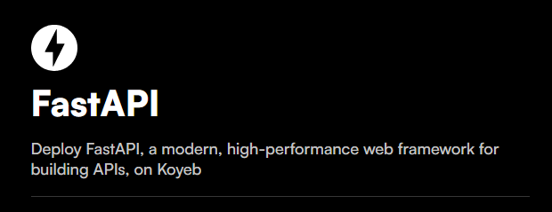

## Vehicle Type Prediction API


This repository contains a FastAPI application deployed on the Koyeb platform. The application uses a pre-trained model to predict the type of vehicle (bus, car, motorcycle, or truck) based on an uploaded image.

## Features

- **FastAPI:** Provides a RESTful API for image uploads and vehicle type predictions.
- **TensorFlow:** Uses a Keras model for vehicle type classification.
- **Image Preprocessing:** Converts uploaded images to the correct format for the model.
- **PIL: Handles image** manipulation and conversion.

## Requirements

- For local testing or development, install the following dependencies:

    ```bash
        pip install fastapi tensorflow pillow uvicorn
    ```

- You can install all the required dependencies at once using the following command:
    ```bash
        pip install -r requirements.txt
    ```

## How to Run the Application Locally

1. **Clone this repository**:
    ```bash
    git clone https://github.com/janakanupehewage/fast-api-project.git
    cd fast-api-project
    ```

2. **Ensure the model file is in place:**:
    Make sure your model file (vehicle_type_identifier_model.keras) is placed in the same directory as main.py.

3. **Run the FastAPI Application:**:
    ```bash
    uvicorn main:app --reload
    ```

4. **Access the API:**:
    ```bash
    http://127.0.0.1:8000
    ```

5. **Swagger UI Documentation: For interactive API documentation, visit:**

    ```bash
    http://127.0.0.1:8000/docs
    ```

## Access the Deployed API on Koyeb

- The application is live on Koyeb. You can access it using the following URL:

    ```bash
        good-hyacinth-fastapi-project-437ba4c1.koyeb.app/
    ```
- The same FastAPI features and functionality are available, allowing you to upload images and receive vehicle type predictions.
